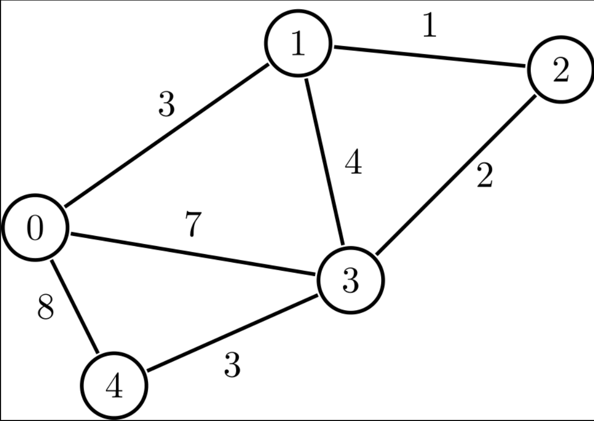

# Graphs 

A graph is a pictorial representation of a set of objects where some pairs of objects are connected by links. The interconnected objects are represented by points termed as vertices, and the links that connect the vertices are called edges.

Here is some common terminology used when working with Graphs:

1. Vertex - A vertex, also called a “node”, is a data object that can have zero or more adjacent vertices.
2. Edge - An edge is a connection between two nodes.
3. Neighbor - The neighbors of a node are its adjacent nodes, i.e., are connected via an edge.
4. Degree - The degree of a vertex is the number of edges connected to that vertex.

## Basic Operations
Following are basic primary operations of a Graph −

1. Add Vertex − Adds a vertex to the graph.

2. Add Edge − Adds an edge between the two vertices of the graph.

3. Display Vertex − Displays a vertex of the graph.

## Directed vs Undirected

**Undirected Graphs**
An Undirected Graph is a graph where each edge is undirected or bi-directional. This means that the undirected graph does not move in any direction.

**Directed Graphs (Digraph)**
A Directed Graph also called a Digraph is a graph where every edge is directed.

Unlike an undirected graph, a Digraph has direction. Each node is directed at another node with a specific requirement of what node should be referenced next.

## Complete vs Connected vs Disconnected

**Complete Graphs**
A complete graph is when all nodes are connected to all other nodes.

**Connected**
A connected graph is graph that has all of vertices/nodes have at least one edge.

**Disconnected** 
A disconnected graph is a graph where some vertices may not have edges.

## Depth First Search

algorithm traverses a graph in a depthward motion and uses a stack to remember to get the next vertex to start a search, when a dead end occurs in any iteration.

It employs the following rules : 
* Rule 1 − Visit the adjacent unvisited vertex. Mark it as visited. Display it. Push it in a stack.

* Rule 2 − If no adjacent vertex is found, pop up a vertex from the stack. (It will pop up all the vertices from the stack, which do not have adjacent vertices.)

* Rule 3 − Repeat Rule 1 and Rule 2 until the stack is empty.

## Breadth First Search
algorithm traverses a graph in a breadthward motion and uses a queue to remember to get the next vertex to start a search, when a dead end occurs in any iteration.

It employs the following rules : 

* Rule 1 − Visit the adjacent unvisited vertex. Mark it as visited. Display it. Insert it in a queue.

* Rule 2 − If no adjacent vertex is found, remove the first vertex from the queue.

* Rule 3 − Repeat Rule 1 and Rule 2 until the queue is empty.

## Weighted Graphs 
A weighted graph is a graph with numbers assigned to its edges. These numbers are called weights. This is what a weighted graph looks like: 

