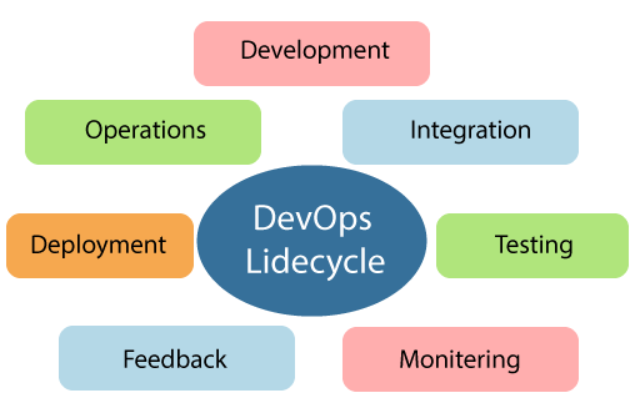
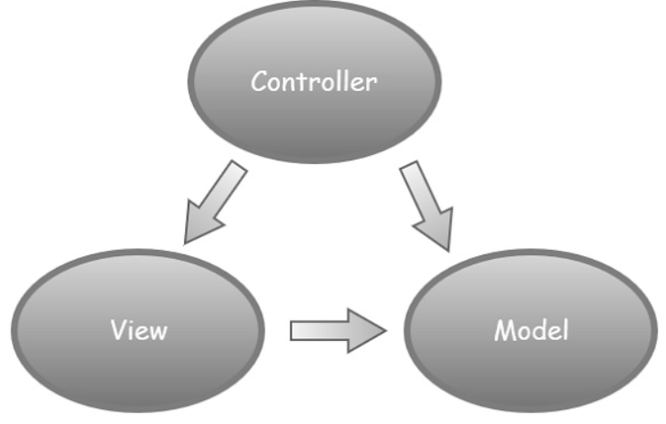

# MVC 

## **Azur DevOps** 

## What is Azure DevOps?
Azure DevOps provides developer services for allowing teams to plan work, collaborate on code development, and build and deploy applications. Azure DevOps supports a collaborative culture and set of processes that bring together developers, project managers, and contributors to develop software. 

Azure DevOps is also known as Microsoft visual studio team services (VSTS). It is a set of collaborative development tools built for the cloud. VSTS was commonly used as a standalone term, and Azure DevOps is a platform which is made up of a few different products, such as:

* Azure Test Plans
* Azure Boards
* Azure Repos
* Azure Pipeline
* Azure Artifacts

## Azure DevOps Server
Azure DevOps Server is a Microsoft product that provides version control, requirements management, reporting, lab management, project management, testing, automated builds, and release management capabilities. It covers the entire application of lifecycle and enables DevOps capabilities.

Azure DevOps can be used as a back-end to the numerous integrated development environments, but it is modified for Microsoft visual studio and eclipse on all platforms.

## Azure DevOps Services
Microsoft announced the release of the software as a service offering of visual studio on the Microsoft Azure platform at the time Microsoft called it a visual studio online.

Microsoft offers visual studio, basic, and stakeholder subscriber access levels for the Azure DevOps services. The basic plan is free of cost for up to five users. Users with a visual studio subscription can be added to a project with no additional charge.

## DevOps Lifecycle
.

## **ASP.NET MVC**
ASP.NET MVC is an open-source software from Microsoft. Its web development framework combines the features of MVC (Model-View-Controller) architecture, the most up-to-date ideas and techniques from Agile development and the best parts of the existing ASP.NET platform.

## History
ASP.NET 1.0 was released on January 5, 2002, as part of .Net Framework version 1.0. At that time, it was easy to think of ASP.NET and Web Forms as one and the same thing. ASP.NET has however always supported two layers of abstraction −

* System.Web.UI − The Web Forms layer, comprising server controls, ViewState, and so on.

* System.Web − It supplies the basic web stack, including modules, handlers, the HTTP stack, etc.

## MVC pattern
.

**Model** − A set of classes that describes the data you are working with as well as the business logic.

**View** − Defines how the application’s UI will be displayed. It is a pure HTML, which decides how the UI is going to look like.

**Controller** − A set of classes that handles communication from the user, overall application flow, and application-specific logic.

## MVC life Cycles −
MVC has two life cycles −

* The Application Life Cycle
The application life cycle refers to the time at which the application process actually begins running IIS until the time it stops. This is marked by the application start and end events in the startup file of your application.

* The Request Life Cycle
It is the sequence of events that happen every time an HTTP request is handled by our application.
The entry point for every MVC application begins with routing. After the ASP.NET platform has received a request, it figures out how it should be handled through the URL Routing Module.

## ASP.NET MVC - Helpers
ASP.NET MVC provides HtmlHelper class which contains different methods that help you create HTML controls programmatically. All HtmlHelper methods generate HTML and return the result as a string. The final HTML is generated at runtime by these functions. The HtmlHelper class is designed to generate UI and it should not be used in controllers or
models.

There are different types of helper methods.

* Createinputs − Creates inputs for text boxes and buttons.

* Createlinks − Creates links that are based on information from the routing tables.

* Createforms − Create form tags that can post back to our action, or to post back to an action on a different controller.

## **Bootstrap**

Bootstrap is the most popular front end framework in the recent time. It is sleek, intuitive, and powerful mobile first front-end framework for faster and easier web development. It uses HTML, CSS and Javascript.

## Why to Learn Bootstrap?

- Mobile first approach − Bootstrap 3, framework consists of Mobile first styles throughout the entire library instead them of in separate files.

- Browser Support − It is supported by all popular browsers.

- Easy to get started − With just the knowledge of HTML and CSS anyone can get started with Bootstrap. Also the Bootstrap official site has a good documentation.

- Responsive design − Bootstrap's responsive CSS adjusts to Desktops, Tablets and Mobiles. More about the responsive design is in the chapter Bootstrap Responsive Design.

- Provides a clean and uniform solution for building an interface for developers.

- It contains beautiful and functional built-in components which are easy to customize.

- It also provides web based customization.

- And best of all it is an open source.

***To learn more*** [Bootstrap](https://www.tutorialspoint.com/bootstrap/index.htm)