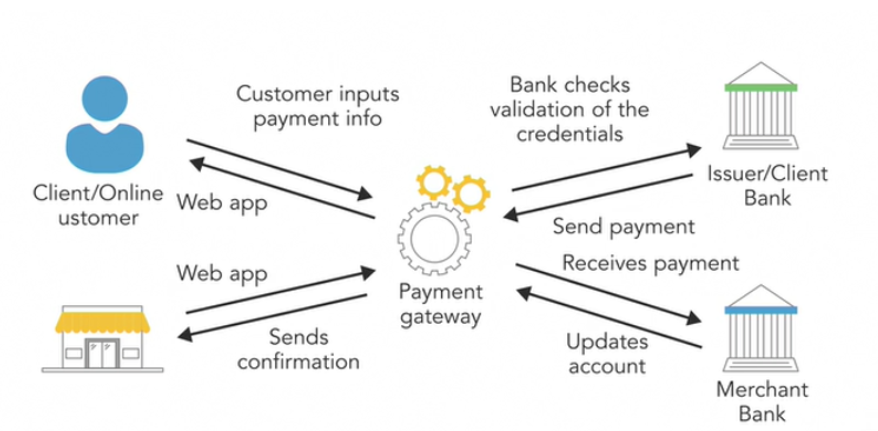

# Payment Processing

## Overview
A payment gateway is an e-commerce software that authorizes payment for online merchants. it’s consumer-facing interfaces used to collect payments. the online stores, the payment gateways are the checkout portals used to enter the credit card information.



## Prerequisites
I expect you to have knowledge of object-oriented programming concepts in C#. I assume you know .NET Core concepts especially the MVC pattern also.


To code along with me, you will have to install the .NET Core 2.2, as well as Visual Studio. You can also use another IDE instead of a visual studio.

Braintree Implementation: 
1. Set up Braintree account
2. Set up the development environment
3. Generate client tokens
4. Card payments

1. Set up Braintree account
First of all, in our browser, we have to go to Braintreepayment.com for signup. for that Braintree will create us a sandbox account. so we can test the API and before to decide our push our app to production. after successfully all things, we have to login into sandbox.braintreegatway.com.


After the first login, when you scroll down, you will find 3 keys(MarchantId, PublicKey, PrivateKey). we actually will use these keys on configuring the .net core application.

2. Set up the development environment
```
{
    "ConnectionStrings": {
        "DefaultConnection": "Server=(localdb)\\mssqllocaldb;
            Database=aspnet-Hellow_payment-2B724855-B8BA-4268-
            8F1E-1054B297FCCF;
            Trusted_Connection=True;
            MultipleActiveResultSets=true"  
    },
    
    "Logging": {
        "LogLevel": {
            "Default": "Warning"    
        }  
    },
    
    "BraintreeGateway": {
        "Environment": "SANDBOX",
        "MerchantId": "br9XXXXXXXxyfj",
        "PublicKey": "8jXXXXXXXXXXXXfzp",
        "PrivateKey": "91XXXXXXXXXXXXXX23"  },
        "AllowedHosts": "*"
}
```

So above all the key value what we need. we found these key values from our sandbox.braintreegatway account.


Let’s get started by opening the existing application, first of all, we are going to add the Braintree package. Go to NuGet to install Braintree .NET Client Library which is supported by both .NET Framework, .NET Core.

Now we will be going to create a Braintree service. we have to create an interface file in our created services folder.
```
public interface IBraintreeService    
{
    IBraintreeGateway CreateGateway();
    IBraintreeGateway GetGateway();    
}
```
Above code, don’t forget to make public this interface. Now we are going to implement members of this interface.


Now we have to create a class file in our created services folder.
```
namespace Hellow_payment.Services
{
    public class BraintreeService : IBraintreeService    
    {
        private readonly IConfiguration _config;
        
        public BraintreeService(IConfiguration config)        
        {
            _config = config;        
        }
        
        public IBraintreeGateway CreateGateway()        
        {
            var newGateway = new BraintreeGateway()            
            {
                Environment = Braintree.Environment.SANDBOX,
                MerchantId = _config.GetValue<string>
                        ("BraintreeGateway:MerchantId"),
                PublicKey = _config.GetValue<string>
                        ("BraintreeGateway:PublicKey"),
                PrivateKey = _config.GetValue<string>
                        ("BraintreeGateway:PrivateKey")            
            };
            
            return newGateway;        
        }
        
        public IBraintreeGateway GetGateway()        
        {
            return CreateGateway();        
        }    
    }
}
```
Above code, To access our key’s from appsettings.json file for that we used the IConfiguration interface.


We have to configure this new service in our startup.cs file. then we are able to inject this service into our controllers.

```
services.AddTransient<IBraintreeService, BraintreeService>();
```

3. Generates client tokens and Card payments

A client token contains all the necessary information to set up the client SDKs.So before that, I think it’s better to create some model for storing data.
```
public class Book    
{        
    [Key]public int Id { get; set; }
    public string Title { get; set; }
    public string Author { get; set; }
    public string Description { get; set; }
    public string Thumbnail { get; set; }
    public string Price { get; set; }    
}

public class BookPurchaseVM : Book    
{
    public string Nonce { get; set; }    
}
```

Now we are generating a token and storing some data in our Controller.
```
public class HomeController : Controller    
{
    private readonly IBraintreeService _braintreeService;
    
    public HomeController(IBraintreeService braintreeService)        
    {
        _braintreeService=braintreeService;        
    }
    public IActionResult Index()        
    {
        var gateway = _braintreeService.GetGateway();
        var clientToken = gateway.ClientToken.Generate();  
        //Genarate a token
        ViewBag.ClientToken=clientToken;
        
        var data = new BookPurchaseVM            
        {
            Id = 2,
            Description = "Hellow man",
            Author = "Me",
            Thumbnail = "This is thumbnail",
            Title = "This is title",
            Price = "230",Nonce=""            
        };
    
    return View(data);        
}
```