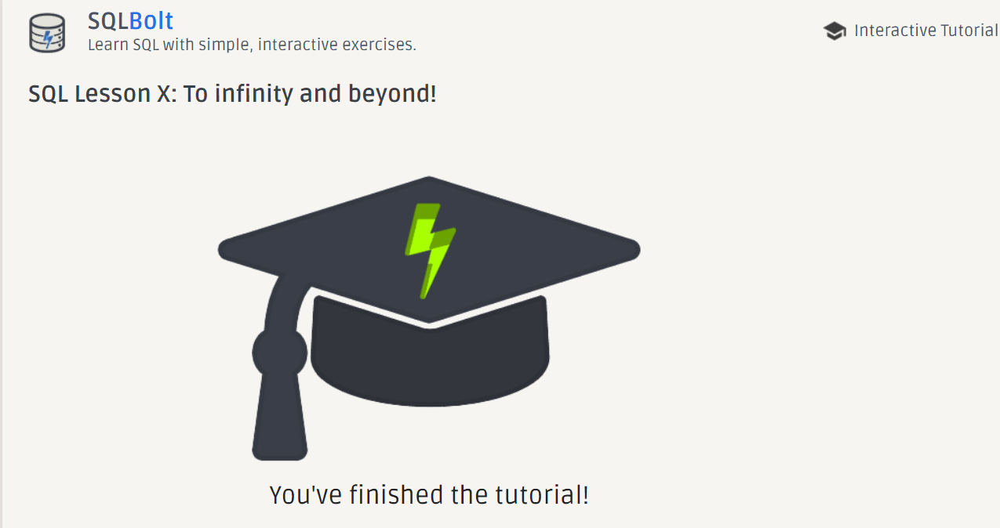

# SQL

[SQL Tutorial]( https://landing.chartio.com/download-learn-sql)
In this tutorial I learned about:
1. Select statment
    - How to get data from the table in database using select statment
    - How to get specific data from the table in database using select statment using **WHERE** 
    - How to get oredered data from the table in database using **OREDER BY**
    -How to sort data ascending and descending by using **DESC and ASC** 
2. Insert statment 
    - How to insert data in the table in database using **INSERT** 
3. Update statment
    - How to update data in database using **UPDATE** 
    - How to update specific data in database using **UPDATE and WHERE**
4. Delete statment
    - How to delete data from database using **DELETE** 
    - How to delete specific data from database using **DELETE and WHERE**      
5. Create statment
    - How to create a new table in database using **CREATE** 
6. Alter statment
    - How to update the table adding OR removing columns using **ALTER TABLE** 
7. Drop statment
    - How to delete(drop) the table from database using **DROP TABLE**          
---